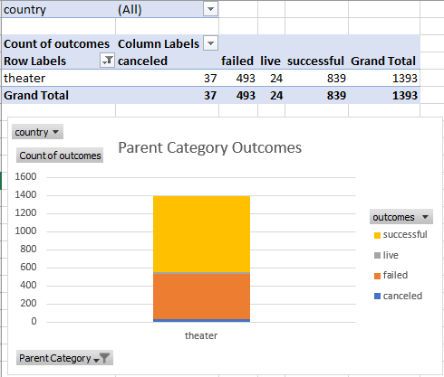
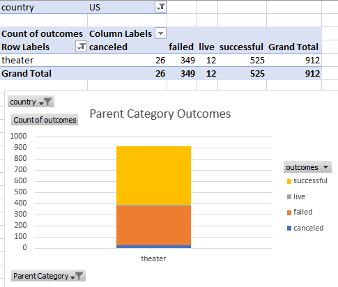
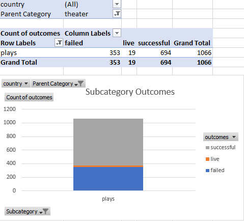
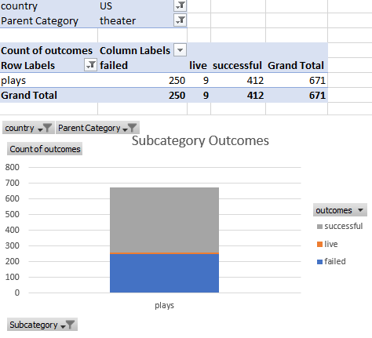
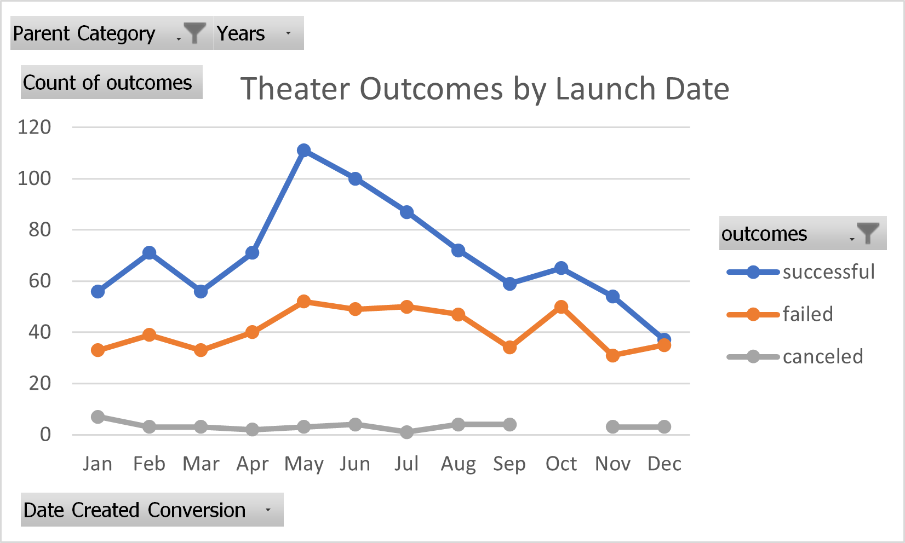
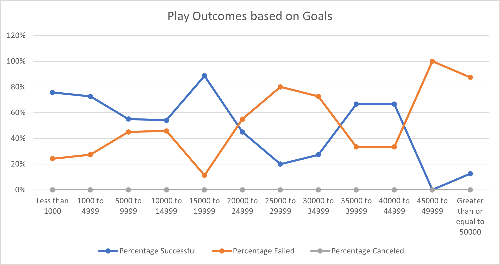

# Kickstarting with Excel

## Overview of Project

### Purpose

Our team was tasked with creating an analysis of crowdfunding data to explore possible trends in the data in the hopes of informing future kickstarter campaigns.  The specific request for our team was to analyze the data to determine 'how different campaigns fared in relation to their launch dates and their funding goals'.  Thus, our analysis will focus on these two perspectives but will also explore other possible trends. Lastly, the customer requesting the analysis has interest in findings related to theater, specifically plays, so the scope of the project will narrow to focus on data and conclusions representative of these interests.  

The data being analyzed consists of crowdfunding events (n=4114) across a variety of categories, in many countries, and over many years. Using filters, pivot tables, and charts, our team has produced an analysis of this data set to uncover specific factors that make crowdfunding campaigns successful. Our team also focused the analysis on the theater category, play subcategory, and US country as these represent the customer's interests. Focusing on these categories helps inform the customer about fundraising strategies to implement to increase the likelihood of a successful fundraising campaign.  

## Analysis and Challenges

The first layer of filtering focused on the theater category (n=1393). Our analysis identified that the majority of campaigns in this category were successful (n=839, 60%) and when further filtered to focus on campaigns in the US, this success rate is maintained (n=525, 58%).  In general, when this is compared to the success rates of fundraising campaigns in other categories, such as food (17%) or games (36%), this success rate is encouraging in that fundraising in the theater category is often successful.  

In the next layer of filtering and sorting, our team focused within the theater category on the play subcategory (n=1066).  Again, the data demonstrates that the majority of campaigns in this subcategory were successful (n=694, 65%) and when focused on campaigns in the US, the success rate is mostly sustained (n=412, 61%). This adds further evidence to the general conclusion that crowdfunding campaigns for theater, and specifically plays, in the US are often successful. 

 
 

Now let's turn to identifying possible strategies the customer can implement to increase the likelihood of achieving a suggessful fundraising campaign for a play in the US.  

### Analysis of Outcomes Based on Launch Date

When the data is filtered to focus on theater fundraising events and the success of those campaigns is compared to the month in which the campaign was launched, the findings seem to suggest a sharp increase in successful events that were initiated in May. However, there was also an increase in failed campaigns for the month of May as well.  When the rates of success are considered instead of counts of successful events, May is found to be slightly higher (67% success) than other months such as April (63%), June (65%), July (63%), September (61%), and November (61%).  These months can be considered as candidates for a launch date to increase the likelihood of a successful campaign. The data also does suggest that December is not an ideal time to launch a fundraising campaign with a success rate no longer in the majority (49%).

### Analysis of Outcomes Based on Goals

When the data is further filtered to focus on theater fundraising events for plays only and the outcomes of those campaigns are compared to the initial fundraising goals, the findings suggest that there are goal intervals with markedly different outcome results.  The data shows that, for campaigns with goals up to $5000, the majority of the campaigns are successful by a large margin (75% successful vs. 25% failure).  That margin shrinks considerably when the fundraising goal is between $5000 and $10,000 (55% successful vs. 45% failure).  That margin increases drastically when the fundraising goal is between $10,000 and to just before $20,000 (89% successful vs. 11% failure).  Our analysis focuses on these intervals since the customer previously identified a possible fundraising goal of $10,000.  

### Challenges and Difficulties Encountered

The previous analyses of outcomes based on launch date and on goals was not filtered to focus on US campaigns.  While the US data does seem to mirror the worldwide data, a closer examination focusing specifically on US data to compare outcomes to launch dates or goals could be informative.  A challenge to this kind of analysis would be the number of data points available for analysis.  Subcategory data for plays in the US shows a total of 617 US campaigns fundraising for plays, of which 412 were successful.  Sorting that data by launch date or by goal may too thinly distribute the data for strong conclusions or findings to be made.  

Additionally, if the customer is interested in keeping their fundraising goal around $10,000, a more granular analysis of the outcomes based on goals is recommended as the margins between successful and failed campaigns near that goal value are highly variable.  Smaller goal intervals and a focus around a goal value of $10,000 could better inform the customer of the likelihood of success of a $10,000 campaign. 

## Results & Recommendations

In summary, the analysis of outcomes based on launch date showed higher success for campaigns launched near the second quarter and weaker success for campaigns launched near the fourth quarter.  The analysis of outcomes based on goals showed a higher success for campaigns with smaller goals (less than $5000) or goals slightly larger than $10,000.  The margins between success and failure for fundraising campaigns for plays was variable, however. To improve this analysis, a more focused outcomes based on goals graph should be constructed and further filtering of the data to focus on US campaigns should be carried out.  If small sample sizes are produced, increasin the size of the data set by looking back to years prior to 2014 should be explored.  

The analysis of this data produces the following recommendations to our customer for a theater/play fundraising campaign:  
It is more likely for a fundraising campiagn for a play to be successful if it is launched near the second quarter (April, May, June, July) and if the fundraising goal is either lowered to be less than $5000 or increased to be between $10,000 and $19,000. Further analysis as recommended above is suggested if greater evidence is required for implementation decisions.  

